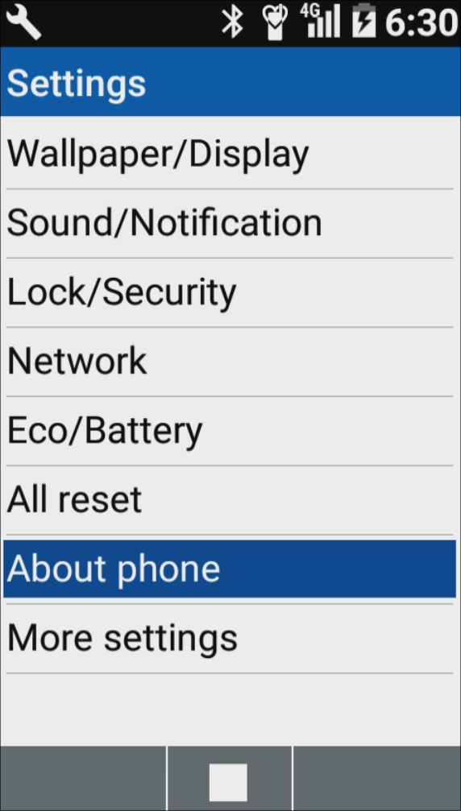

# Table of contents
{: .no_toc}
* TOC
{:toc}

# Introduction

Hello everyone, recently I decided to switch to a new phone, the [Kyocera 501KC](https://www.kyocera.co.jp/prdct/telecom/consumer/lineup/digno-keitai/){:target="_blank"}. It is a [clamshell design](https://en.wikipedia.org/wiki/Flip_phone) phone, I got it because I like the design and its simplicity. It provides me with the ability to communicate with others without the [notification fatigue](https://indieweb.org/notification_fatigue) that comes with modern smartphones. I will be sharing my experience with this phone in this post.

# [Design](https://www.kyocera.co.jp/prdct/telecom/consumer/lineup/digno-keitai/design/){:target="_blank"}

As mentioned before this is a beautiful Japanese flip phone with 3.4-inch [FWVGA](https://en.wikipedia.org/wiki/Display_resolution_standards#FWVGA){:target="_blank"}(854x480) display on the front and a 0.9inch subdisplay for time, battery status notifications and other metrics.

# [Features](https://www.kyocera.co.jp/prdct/telecom/consumer/lineup/digno-keitai/function1/){:target="_blank"}

This phone is resistant to water, dust and falls. It has an 8MP camera, keypad, 4G LTE... those metrics are cool and all but it is just numbers for most of the people that can be found elsewhere. I want to talk about the features that I appreciate the most.
- ***Keypad:*** I like the feeling of writing things on it. It allows me to take my time and think about how I want to express myself. It also doubles up as touchpad.
- ***Camera:*** The camera is a bit old, but it gives the photos a unique charm. I love the grainy photos, in my opinion, it makes them more personal.
- ***Notification light:*** It has a notification light that blinks when you have a missed call or a message.
- ***Bluetooth:*** The phone has Bluetooth, I can connect my Bluetooth earphones to it and listen to music or audiobooks.
- ***Fast (4G) internet:*** It has 4G internet, I can browse the web, check my emails use apps either preinstalled or [sideloaded](#sideloading-apps).

# Possible annoyances

- ***Wi-Fi***: The phone is not able to connect to Wi-Fi, I have to use my mobile data.
- ***No audio jack***: The phone does not have an audio jack, I have to use Bluetooth earphones.
- ***No app store***: The phone does not have an app store, any apps that are not preinstalled need to be installed manually [sideloaded](#sideloading-apps).
- ***Old Android (5)***: The phone runs on Android 5, it is old and not supported by many apps, or even to make apps for it..

# Sideloading apps

To side load an application we need apk file, [ADB](https://developer.android.com/tools/adb){:target="_blank"}, USB cable and be developer on the phone.
## Installing ADB

### Linux

```bash
sudo apt install adb                      #[On Debian/Ubuntu]
sudo yum install adb                      #[On RHEL/CentOS/Fedora and Rocky/AlmaLinux]
sudo emerge -a dev-util/android-tools     #[On Gentoo Linux]
sudo apk add adb                          #[On Alpine Linux]
sudo pacman -S android-tools              #[On Arch Linux]
sudo zypper install adb                   #[On OpenSUSE]
```
### [Windows](https://www.xda-developers.com/install-adb-windows-macos-linux/#how-to-set-up-adb-on-your-computer){:target="_blank"}

## Enabling developer permissions

<div style=" text-align: center;">
    <p>1. Go to <u>Settings</u> and go to <u>About phone</u></p>
</div>
<div style="display: flex; justify-content: center; ">
    
    
</div>
<div style=" text-align: center;">
    <p>2. In <u>About phone</u> click <u>Build number</u> until you see a message that you are a developer.</p>
</div>
<div style="display: flex; justify-content: center;">
    
</div>
<div style=" text-align: center;">
    <p>3. Go back to <u>Settings</u> and click on <u>Developer options</u> and there enable <u>USB debugging</u>.</p>
</div>
<div style="display: flex; justify-content: center;">
    
    
</div>

## Working with ADB

When you have installed ADB and enabled developer permissions you can connect your phone to your computer, allow USB debugging and run the following commands.
```bash
adb devices                     # Initialize ADB and check if your phone is connected
adb install app.apk             # Install the app
```

# Recommendations for apps (only open source)

- [Gramophone](https://f-droid.org/en/packages/org.akanework.gramophone/){:target="_blank"}: Music player with simple interface and written for android 5.
- [Traditional T9](https://f-droid.org/en/packages/io.github.sspanak.tt9/){:target="_blank"}: Keyboard that makes it easier to write fast, I prefer original solution of the phone but this is great as well.
- [KeePassDX](https://f-droid.org/en/packages/com.kunzisoft.keepass.libre/){:target="_blank"}: As mentioned in my [previous post](/blog/0002-MyToolBox#recommendation-for-android){:target="_blank"}, KeepassDX is a great way to access your passwords on your phone.
- [Fennec F-Droid](https://f-droid.org/en/packages/org.mozilla.fennec_fdroid/){:target="_blank"}: Firefox browser, to provide you with a modern browsing experience.

# Non open source apps

You can also install non open source apps, as long you have the apk file and it is compatible with Android 5 you can try to install it.

# Setting up cellular network

To set up cellular network you need to go set the APN settings based on your cellular provider specifications. I know T-Mobile works but I am not sure about other providers.

# SMS, Email, Call and Calendar

First of all, if you are using TT9 keyboard, the native apps for the device may be acting a bit funky, the SMS app will only send the message after you quit the app and check your drafts, or after switching between keyboards to confirm. You can either use the normal keyboard for those apps or try out non native apps. For email you can use [K-9 Mail](https://f-droid.org/en/packages/com.fsck.k9/){:target="_blank"}, you will also need app for SMS, I have not been able to find one but I am sure you can find some. For calender then you would use [Etar](https://f-droid.org/en/packages/ws.xsoh.etar/){:target="_blank"} it may have dropped support for Android 5 but you can always just get the old version. I have not found a good SMS app but I am sure you can find one as well.

### Pictures

<div style="display: flex; justify-content: center;">
    
    
    
</div>
